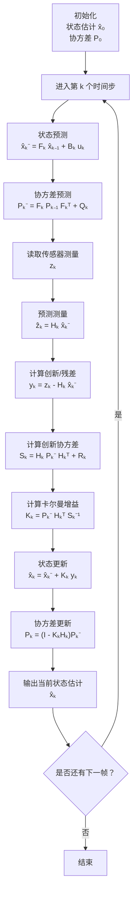
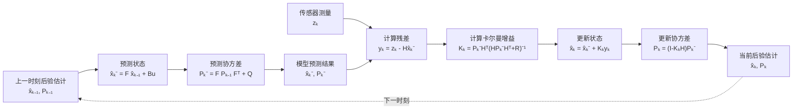
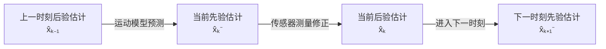
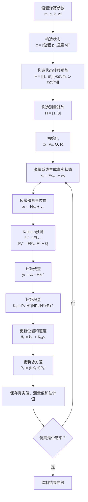
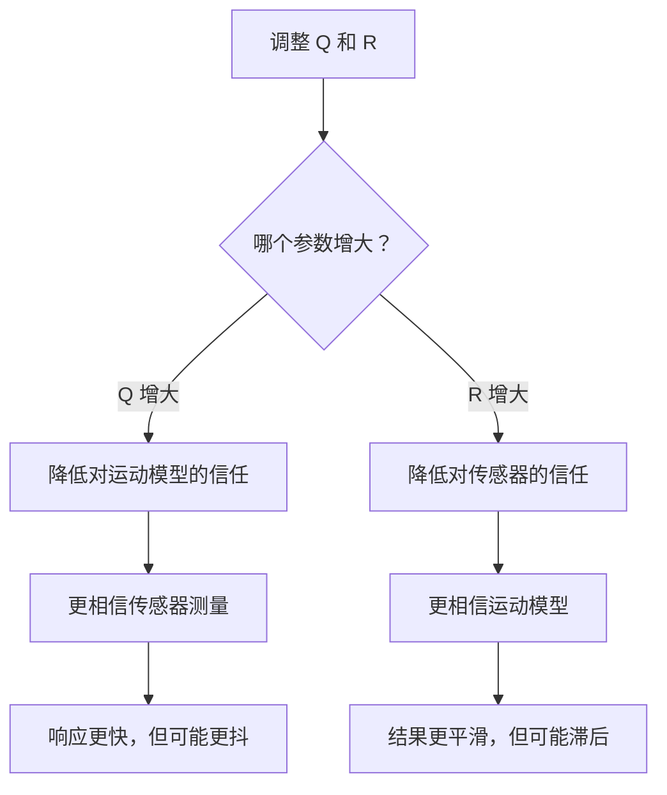
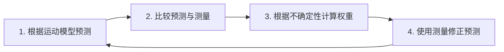

# 卡尔曼滤波完整流程

## 1. 卡尔曼滤波解决什么问题？

卡尔曼滤波用于根据以下两类信息估计系统的真实状态：

1. **系统运动模型**：根据上一时刻的状态预测当前状态；
2. **传感器测量结果**：通过带噪声的观测修正预测结果。

其基本思想可以概括为：

> 先根据物理模型进行预测，再根据传感器测量进行修正。

假设系统的真实状态为：

```math
\mathbf{x}_k
```

传感器测量为：

```math
\mathbf{z}_k
```

由于传感器存在噪声，通常有：

```math
\mathbf{z}_k \neq \mathbf{x}_k
```

卡尔曼滤波通过不断执行“预测—更新”循环，得到对真实状态的最优估计。

---

## 2. 完整流程图



---

# 3. 系统模型

卡尔曼滤波通常使用以下离散状态空间模型。

## 3.1 状态转移模型

```math
\mathbf{x}_k
=
\mathbf{F}_k\mathbf{x}_{k-1}
+
\mathbf{B}_k\mathbf{u}_k
+
\mathbf{w}_k
```

其中：

| 符号             | 含义            |
| -------------- | ------------- |
| $`\mathbf{x}_k`$ | 第 $`k`$ 时刻的真实状态 |
| $`\mathbf{F}_k`$ | 状态转移矩阵        |
| $`\mathbf{u}_k`$ | 控制输入          |
| $`\mathbf{B}_k`$ | 控制输入矩阵        |
| $`\mathbf{w}_k`$ | 过程噪声          |

过程噪声通常假设服从零均值高斯分布：

```math
\mathbf{w}_k
\sim
\mathcal{N}(\mathbf{0},\mathbf{Q}_k)
```

其中：

```math
\mathbf{Q}_k
```

为过程噪声协方差矩阵，用于描述运动模型的不确定性。

例如，恒定速度模型假设速度不变，但真实物体可能突然加速，因此需要使用过程噪声描述模型与真实运动之间的误差。

---

## 3.2 测量模型

```math
\mathbf{z}_k
=
\mathbf{H}_k\mathbf{x}_k
+
\mathbf{v}_k
```

其中：

| 符号             | 含义             |
| -------------- | -------------- |
| $`\mathbf{z}_k`$ | 第 $`k`$ 时刻的传感器测量 |
| $`\mathbf{H}_k`$ | 测量矩阵           |
| $`\mathbf{v}_k`$ | 测量噪声           |

测量噪声通常假设为：

```math
\mathbf{v}_k
\sim
\mathcal{N}(\mathbf{0},\mathbf{R}_k)
```

其中：

```math
\mathbf{R}_k
```

为测量噪声协方差矩阵，用于描述传感器的不确定性。

例如，相机测量物体位置时，检测误差、深度噪声和运动模糊都会反映在 $`\mathbf{R}_k`$ 中。

---

# 4. 初始化

在开始滤波之前，需要设置：

```math
\hat{\mathbf{x}}_0
```

和：

```math
\mathbf{P}_0
```

其中：

* $`\hat{\mathbf{x}}_0`$：系统初始状态估计；
* $`\mathbf{P}_0`$：初始状态估计的协方差。

例如，对于一维弹簧阻尼系统，可以定义状态：

```math
\mathbf{x}
=
\begin{bmatrix}
p\\
v
\end{bmatrix}
```

其中：

* $`p`$：质量块位置；
* $`v`$：质量块速度。

初始状态可以设置为：

```math
\hat{\mathbf{x}}_0
=
\begin{bmatrix}
0.8\\
0
\end{bmatrix}
```

初始协方差可以设置为：

```math
\mathbf{P}_0
=
\begin{bmatrix}
1 & 0\\
0 & 1
\end{bmatrix}
```

较大的 $`\mathbf{P}_0`$ 表示滤波器对初始状态不太确定。

---

# 5. 预测阶段

预测阶段使用上一时刻的估计结果，通过运动模型预测当前状态。

## 5.1 状态预测

```math
\hat{\mathbf{x}}_{k}^{-}
=
\mathbf{F}_k\hat{\mathbf{x}}_{k-1}
+
\mathbf{B}_k\mathbf{u}_k
```

其中上标 $`-`$ 表示：

> 这是在读取当前传感器测量之前得到的先验估计。

如果系统没有控制输入，可以写为：

```math
\hat{\mathbf{x}}_{k}^{-}
=
\mathbf{F}_k\hat{\mathbf{x}}_{k-1}
```

### 直观理解

假设上一时刻估计的位置和速度为：

```math
\hat{\mathbf{x}}_{k-1}
=
\begin{bmatrix}
1.0\\
0.5
\end{bmatrix}
```

采样周期为：

```math
\Delta t=0.1
```

使用恒定速度模型：

```math
\mathbf{F}
=
\begin{bmatrix}
1 & \Delta t\\
0 & 1
\end{bmatrix}
```

则：

```math
\hat{\mathbf{x}}_k^{-}
=
\begin{bmatrix}
1 & 0.1\\
0 & 1
\end{bmatrix}
\begin{bmatrix}
1.0\\
0.5
\end{bmatrix}
=
\begin{bmatrix}
1.05\\
0.5
\end{bmatrix}
```

因此，滤波器预测物体当前位于 (1.05) 米处。

---

## 5.2 协方差预测

只预测状态还不够，卡尔曼滤波还需要预测状态的不确定性：

```math
\mathbf{P}_k^{-}
=
\mathbf{F}_k
\mathbf{P}_{k-1}
\mathbf{F}_k^T
+
\mathbf{Q}_k
```

其中：

* $`\mathbf{P}_{k-1}`$：上一时刻估计的不确定性；
* $`\mathbf{Q}_k`$：运动模型自身的不确定性；
* $`\mathbf{P}_k^{-}`$：当前预测状态的不确定性。

### 为什么要加上 $`\mathbf{Q}_k`$？

因为运动模型通常不是完全准确的。

例如，恒速模型假设：

```math
v_k=v_{k-1}
```

但真实物体可能会：

* 加速；
* 减速；
* 转向；
* 受到外部冲击。

因此，每经过一次预测，状态的不确定性通常会增加。

---

# 6. 获取传感器测量

第 $`k`$ 时刻的传感器测量为：

```math
\mathbf{z}_k
```

例如传感器只测量位置：

```math
\mathbf{z}_k
=
\begin{bmatrix}
p_k^{\text{measured}}
\end{bmatrix}
```

假设状态中同时包含位置和速度：

```math
\mathbf{x}_k
=
\begin{bmatrix}
p_k\\
v_k
\end{bmatrix}
```

由于传感器只能测量位置，因此测量矩阵为：

```math
\mathbf{H}
=
\begin{bmatrix}
1 & 0
\end{bmatrix}
```

于是：

```math
\mathbf{H}\mathbf{x}_k
=
\begin{bmatrix}
1 & 0
\end{bmatrix}
\begin{bmatrix}
p_k\\
v_k
\end{bmatrix}
=
p_k
```

测量矩阵 $`\mathbf{H}`$ 的作用是：

> 把完整状态映射到传感器能够观测的空间。

---

# 7. 计算预测测量

根据预测状态，可以计算滤波器预计传感器应该测到什么：

```math
\hat{\mathbf{z}}_k
=
\mathbf{H}_k\hat{\mathbf{x}}_k^{-}
```

例如：

```math
\hat{\mathbf{x}}_k^{-}
=
\begin{bmatrix}
1.05\\
0.5
\end{bmatrix}
```

且：

```math
\mathbf{H}
=
\begin{bmatrix}
1 & 0
\end{bmatrix}
```

则预测测量为：

```math
\hat{\mathbf{z}}_k
=
\begin{bmatrix}
1 & 0
\end{bmatrix}
\begin{bmatrix}
1.05\\
0.5
\end{bmatrix}
=
1.05
```

也就是说，滤波器预计传感器应该测量到 (1.05) 米。

---

# 8. 计算创新或残差

实际测量和预测测量之间的差值称为创新或残差：

```math
\mathbf{y}_k
=
\mathbf{z}_k
-
\mathbf{H}_k\hat{\mathbf{x}}_k^{-}
```

也可以写成：

```math
\mathbf{y}_k
=
\mathbf{z}_k-\hat{\mathbf{z}}_k
```

假设传感器实际测量为：

```math
\mathbf{z}_k=1.08
```

预测测量为：

```math
\hat{\mathbf{z}}_k=1.05
```

则：

```math
\mathbf{y}_k
=
1.08-1.05
=
0.03
```

这个残差表示：

> 实际测量比运动模型预测的位置大 (0.03) 米。

残差是卡尔曼滤波修正预测状态的直接依据。

---

# 9. 创新协方差

创新本身也存在不确定性，其协方差为：

```math
\mathbf{S}_k
=
\mathbf{H}_k
\mathbf{P}_k^{-}
\mathbf{H}_k^T
+
\mathbf{R}_k
```

其中：

* $`\mathbf{H}_k\mathbf{P}_k^{-}\mathbf{H}_k^T`$：预测测量的不确定性；
* $`\mathbf{R}_k`$：传感器测量的不确定性；
* $`\mathbf{S}_k`$：预测与测量之差的不确定性。

因此，$`\mathbf{S}_k`$ 同时考虑了：

1. 运动模型有多不可靠；
2. 传感器有多不可靠。

---

# 10. 卡尔曼增益

卡尔曼增益计算公式为：

```math
\mathbf{K}_k
=
\mathbf{P}_k^{-}
\mathbf{H}_k^T
\mathbf{S}_k^{-1}
```

将 $`\mathbf{S}_k`$ 展开后：

```math
\mathbf{K}_k
=
\mathbf{P}_k^{-}
\mathbf{H}_k^T
\left(
\mathbf{H}_k
\mathbf{P}_k^{-}
\mathbf{H}_k^T
+
\mathbf{R}_k
\right)^{-1}
```

卡尔曼增益决定：

> 当前更新应该更加相信运动模型，还是更加相信传感器测量。

## 10.1 卡尔曼增益较大

当预测不确定性较大，而传感器比较准确时：

```math
\mathbf{P}_k^{-}\text{ 较大},
\qquad
\mathbf{R}_k\text{ 较小}
```

此时：

```math
\mathbf{K}_k\text{ 较大}
```

滤波器更加相信传感器测量。

---

## 10.2 卡尔曼增益较小

当运动模型比较可靠，而传感器噪声较大时：

```math
\mathbf{P}_k^{-}\text{ 较小},
\qquad
\mathbf{R}_k\text{ 较大}
```

此时：

```math
\mathbf{K}_k\text{ 较小}
```

滤波器更加相信模型预测。

---

## 10.3 一维情况下的直观形式

在简单的一维系统中，卡尔曼增益可以近似理解为：

```math
K
=
\frac{\text{预测不确定性}}
{\text{预测不确定性}+\text{测量不确定性}}
```

因此：

* 测量越准确，$`K`$ 越接近 1；
* 测量越不准确，$`K`$ 越接近 0。

---

# 11. 状态更新

使用卡尔曼增益和创新修正预测状态：

```math
\hat{\mathbf{x}}_k
=
\hat{\mathbf{x}}_k^{-}
+
\mathbf{K}_k\mathbf{y}_k
```

将创新展开：

```math
\hat{\mathbf{x}}_k
=
\hat{\mathbf{x}}_k^{-}
+
\mathbf{K}_k
\left(
\mathbf{z}_k
-
\mathbf{H}_k\hat{\mathbf{x}}_k^{-}
\right)
```

它可以理解为：

```math
\text{最终估计}
=
\text{模型预测}
+
\text{增益}
\times
\text{预测误差}
```

假设：

```math
\hat{x}_k^{-}=1.05
```

```math
z_k=1.08
```

```math
K_k=0.7
```

则：

```math
\hat{x}_k
=
1.05+0.7(1.08-1.05)
```

```math
\hat{x}_k
=
1.071
```

最终结果位于预测值 (1.05) 和测量值 (1.08) 之间。

---

# 12. 协方差更新

状态更新后，还需要更新滤波器对当前结果的不确定性：

```math
\mathbf{P}_k
=
\left(
\mathbf{I}
-
\mathbf{K}_k\mathbf{H}_k
\right)
\mathbf{P}_k^{-}
```

其中：

```math
\mathbf{I}
```

为单位矩阵。

测量更新之后，滤波器获得了新的信息，因此通常有：

```math
\mathbf{P}_k
<
\mathbf{P}_k^{-}
```

这意味着：

> 融合传感器测量以后，滤波器对状态估计更加有信心。

数值计算中，还可以使用更稳定的 Joseph 形式：

```math
\mathbf{P}_k
=
\left(
\mathbf{I}-\mathbf{K}_k\mathbf{H}_k
\right)
\mathbf{P}_k^{-}
\left(
\mathbf{I}-\mathbf{K}_k\mathbf{H}_k
\right)^T
+
\mathbf{K}_k\mathbf{R}_k\mathbf{K}_k^T
```

Joseph 形式计算量稍大，但能够更好地保持协方差矩阵的对称性和半正定性。

---

# 13. 单次循环的紧凑流程图



---

# 14. 先验估计与后验估计

卡尔曼滤波中经常出现两种状态估计。

## 14.1 先验估计

```math
\hat{\mathbf{x}}_k^{-}
```

表示只使用运动模型预测出的当前状态，尚未融合当前测量。

对应的不确定性为：

```math
\mathbf{P}_k^{-}
```

---

## 14.2 后验估计

```math
\hat{\mathbf{x}}_k
```

表示已经融合当前传感器测量后的状态估计。

对应的不确定性为：

```math
\mathbf{P}_k
```

两者关系可以表示为：



---

# 15. 与弹簧阻尼系统结合

弹簧阻尼系统满足：

```math
m\ddot{p}
+
c\dot{p}
+
kp
=
0
```

其中：

* $`m`$：质量；
* $`c`$：阻尼系数；
* $`k`$：弹簧刚度；
* $`p`$：位置。

定义状态：

```math
\mathbf{x}
=
\begin{bmatrix}
p\\
v
\end{bmatrix}
```

其中：

```math
v=\dot{p}
```

则连续时间状态方程为：

```math
\dot{\mathbf{x}}
=
\begin{bmatrix}
\dot{p}\\
\dot{v}
\end{bmatrix}
=
\begin{bmatrix}
v\\
-\dfrac{k}{m}p-\dfrac{c}{m}v
\end{bmatrix}
```

写成矩阵形式：

```math
\dot{\mathbf{x}}
=
\begin{bmatrix}
0 & 1\\
-\dfrac{k}{m} & -\dfrac{c}{m}
\end{bmatrix}
\mathbf{x}
```

使用简单欧拉离散化：

```math
\mathbf{x}_{k+1}
\approx
\mathbf{x}_k
+
\Delta t
\dot{\mathbf{x}}_k
```

得到离散状态转移矩阵：

```math
\mathbf{F}
=
\begin{bmatrix}
1 & \Delta t\\
-\dfrac{k}{m}\Delta t &
1-\dfrac{c}{m}\Delta t
\end{bmatrix}
```

因此：

```math
\mathbf{x}_{k+1}
=
\mathbf{F}\mathbf{x}_k
+
\mathbf{w}_k
```

如果传感器只测量位置，则：

```math
\mathbf{z}_k
=
\begin{bmatrix}
1 & 0
\end{bmatrix}
\mathbf{x}_k
+
\mathbf{v}_k
```

所以测量矩阵为：

```math
\mathbf{H}
=
\begin{bmatrix}
1 & 0
\end{bmatrix}
```

---

# 16. 弹簧阻尼系统的卡尔曼滤波流程



---

# 17. 参数 Q 和 R 的作用

## 17.1 过程噪声协方差 Q

```math
\mathbf{Q}
```

描述运动模型的不确定性。

### Q 较小

表示非常相信运动模型：

* 输出更加平滑；
* 对突然运动响应较慢；
* 如果模型不准确，可能产生明显偏差。

### Q 较大

表示不太相信运动模型：

* 更快响应运动变化；
* 更加依赖传感器；
* 输出可能出现更多抖动。

---

## 17.2 测量噪声协方差 R

```math
\mathbf{R}
```

描述传感器测量的不确定性。

### R 较小

表示传感器非常准确：

* 卡尔曼增益增大；
* 估计快速跟随测量；
* 测量噪声可能被带入估计结果。

### R 较大

表示传感器噪声较大：

* 卡尔曼增益减小；
* 估计更加依赖模型；
* 输出更加平滑，但可能存在滞后。

---

## 17.3 参数关系



---

# 18. 每一帧的伪代码

```text
初始化状态估计 x_hat
初始化协方差 P
设置状态转移矩阵 F
设置测量矩阵 H
设置过程噪声 Q
设置测量噪声 R

循环处理每一帧：

    # 预测
    x_predict = F @ x_hat
    P_predict = F @ P @ F.T + Q

    # 获取传感器测量
    z = sensor_measurement()

    # 计算测量残差
    y = z - H @ x_predict

    # 计算创新协方差
    S = H @ P_predict @ H.T + R

    # 计算卡尔曼增益
    K = P_predict @ H.T @ inverse(S)

    # 更新状态
    x_hat = x_predict + K @ y

    # 更新协方差
    P = (I - K @ H) @ P_predict
```

---

# 19. 公式汇总

## 系统模型

```math
\mathbf{x}_k
=
\mathbf{F}_k\mathbf{x}_{k-1}
+
\mathbf{B}_k\mathbf{u}_k
+
\mathbf{w}_k
```

## 测量模型

```math
\mathbf{z}_k
=
\mathbf{H}_k\mathbf{x}_k
+
\mathbf{v}_k
```

## 状态预测

```math
\hat{\mathbf{x}}_k^{-}
=
\mathbf{F}_k\hat{\mathbf{x}}_{k-1}
+
\mathbf{B}_k\mathbf{u}_k
```

## 协方差预测

```math
\mathbf{P}_k^{-}
=
\mathbf{F}_k
\mathbf{P}_{k-1}
\mathbf{F}_k^T
+
\mathbf{Q}_k
```

## 创新

```math
\mathbf{y}_k
=
\mathbf{z}_k
-
\mathbf{H}_k\hat{\mathbf{x}}_k^{-}
```

## 创新协方差

```math
\mathbf{S}_k
=
\mathbf{H}_k
\mathbf{P}_k^{-}
\mathbf{H}_k^T
+
\mathbf{R}_k
```

## 卡尔曼增益

```math
\mathbf{K}_k
=
\mathbf{P}_k^{-}
\mathbf{H}_k^T
\mathbf{S}_k^{-1}
```

## 状态更新

```math
\hat{\mathbf{x}}_k
=
\hat{\mathbf{x}}_k^{-}
+
\mathbf{K}_k\mathbf{y}_k
```

## 协方差更新

```math
\mathbf{P}_k
=
\left(
\mathbf{I}
-
\mathbf{K}_k\mathbf{H}_k
\right)
\mathbf{P}_k^{-}
```

---

# 20. 核心逻辑总结

卡尔曼滤波的完整循环可以压缩成四个核心步骤：



其本质不是简单平均预测和测量，而是根据双方的不确定性自动分配权重：

```math
\boxed{
\text{新估计}
=
\text{预测值}
+
\text{卡尔曼增益}
\times
\left(
\text{测量值}
-
\text{预测测量值}
\right)
}
```

其中：

* 运动模型越可靠，越相信预测；
* 传感器越可靠，越相信测量；
* 每次更新后，滤波器都会重新计算自身的不确定性；
* 下一帧继续使用更新后的结果进行预测。

因此，卡尔曼滤波是一个不断循环的：

```math
\boxed{
\text{预测}
\rightarrow
\text{测量}
\rightarrow
\text{比较}
\rightarrow
\text{融合}
\rightarrow
\text{再次预测}
}
```
